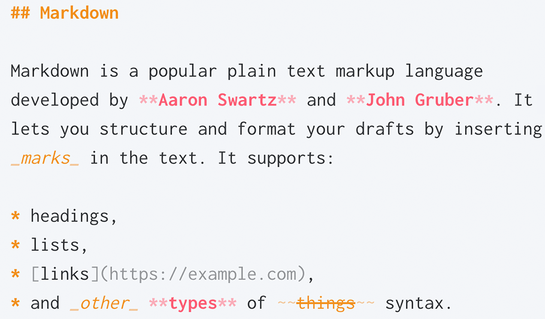

```{post} 2023-06-30
:author: GuayaHack
:tags: newbie, organización, incompleto
:category: wiki
:language: Español
:excerpt: 1
```

# Como Contribuir a la main @ GuayaHack

#todo:escribir

## H21


```{figure} template.md-data/tux.png
---
---
Tux
```


## H22

### H3

## Convenciones

Para una mayor trazabilidad, se propone lo siguiente. 
- No utilizar `_` (guión bajo) o `+` (mas) en nombres de archivos y carpetas. En su lugar, se debe utilizar `-` (guión)

- El lenguaje de marcado es Markdown. Se pueden encontrar las siguientes convenciones:


- Los path de ubicación de archivos y referencias funcionan con  `/` (slash) en lugar de `\` (backslash)

### TODOs

Siempre en minúscula y con éste preciso formato: `#todo:categoría descripción`

Las categorías que tenemos son:

| categoría | descripción |
|-----------|-------------|
| escribir/write | para contribuir documentación que falta |
| fix/reparar | para resolver problemas en el código |
| ... | ... |
| ... | ... |

### Notas al Pie | Footnotes

Cuando usen notas al pie de página tipo `[^NOTA] ... [^NOTA]:LINK`, siempre debemos poner un header `# Notas al Pie` al final para que se vea bien.


## Contribuciones 

{doc}`/community/member/jdsalaro/index`,

