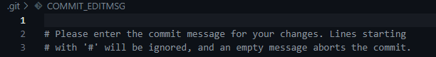
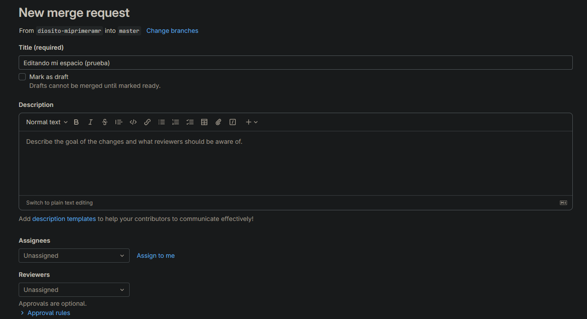

```{post} 2023-07-21
:author: GuayaHack
:tags: newbie, IDE
:category: wiki
:language: Español
:excerpt: 1
```

# Guía Paso a Paso: Cómo Usar GIT en Visual Studio Code

¡Hola compañero de programación! En este archivo Markdown, te explicaré paso a paso cómo realizar un commit y push en Git desde Visual Studio Code (VSCode) en un proyecto previamente creado en GitLab. ¡Comencemos!

## 1. Configuración inicial

Antes de empezar, asegúrate de tener lo siguiente:

- VSCode instalado en tu computadora.
- Git instalado y configurado en tu sistema.
- Una cuenta en GitLab y un proyecto ya creado en tu cuenta.

## 2. Clonar el repositorio

Primero, necesitas clonar el repositorio de GitLab en tu computadora local:

1. Abre VSCode y selecciona "View" en la barra de menú.
2. Luego, elige "Command Palette" (o presiona `Ctrl+Shift+P` en Windows/Linux o `Cmd+Shift+P` en macOS) Se abrirá un menú como este:


3. Escribe "Git: Clone" y selecciona esa opción.
4. Ingresa la URL del repositorio GitLab que deseas clonar (en este caso GuayaHack) y elige una ubicación cómoda en tu computadora para guardar el proyecto.

## 3. Abrir el proyecto clonado

1. Después de clonar el repositorio, selecciona "File" en la barra de menú y haz clic en "Open Folder".
2. Selecciona la carpeta que contiene el repositorio que clonaste y haz clic en "Abrir" (Open).

## 4. Hacer cambios en el código

Ahora puedes modificar los archivos en tu proyecto como lo desees. Cuando hayas realizado los cambios que deseas guardar, sigue estos pasos:

## 5. Realizar un commit

1. Abre la pestaña de "Source Control" en el menú lateral izquierdo de VSCode. Puedes identificar el ícono de Git, se verá algo así:


2. Selecciona los archivos que deseas incluir en el commit marcándolos con el signo "+" junto a ellos. Esto los agrega a la "Staging Area".


3. Escribe un mensaje descriptivo y claro para el commit en el campo "Message" que se encuentra en la parte superior de la "Source Control" (por ejemplo: "Agregados nuevos estilos CSS").
4. Presiona `Ctrl+Enter` en Windows/Linux o `Cmd+Enter` en macOS para realizar el commit (o presiona el botón verde "Commit").

5. Te podrá aparecer un archivo cómo el siguiente: 



<center> Solo debes rellenarlo con un mensaje que describa los cambios que realizaste y hacer click en el chulo para aceptar.</center>


## 6. Realizar un push

Después de hacer el commit, los cambios aún están solo en tu repositorio local. Para subirlos a GitLab, necesitas hacer un push:

1. Asegúrate de estar conectado a tu cuenta de GitLab en VSCode. Si no lo has hecho, se te pedirá que inicies sesión al realizar el primer push.

2. Haz clic en el botón con la flecha hacia arriba (Push) en la parte superior del panel "Source Control", también puedes dar a los 3 puntos en la parte superior del panel "Source Control" y hacer clic en "Push".

3. Verás una notificación que indica que el push fue exitoso.

## 7. Crear un Merge Request (MR)

Una Merge Request (MR) es una solicitud para fusionar los cambios realizados en una rama con otra, generalmente hacia la rama principal.

1. Ve al repositorio en GitLab donde hiciste el push desde VSCode.

2. Asegúrate de estar en la rama correcta.

3. Haz clic en "New Merge Request" o "Crear Merge Request".

4. Verifica los detalles:


   
   - **Source Branch**: Debe ser la rama donde realizaste el push.
   
   - **Target Branch**: Selecciona la rama de destino, generalmente la rama principal.
   
   - **Title**: Proporciona un título descriptivo.

   - **Assignees**: Quien realizó los cambios

   - **Reviewers**: Revisores

5. Describe tus cambios y asigna revisores si es necesario.

6. Haz clic en "Create Merge Request" o "Crear Merge Request".

7. Los revisores evaluarán tus cambios y si todo está bien, aprobarán la solicitud.

8. Haz clic en "Merge" o "Fusionar" para completar la fusión.

¡Y listo! Tus cambios se fusionarán en la rama de destino una vez aprobada la Merge Request. Utilizar MRs es una buena práctica para mantener la calidad del proyecto. ¡Buena suerte!

## 8. (Extra) Actualizar el repositorio

Si trabajas en colaboración con otros desarrolladores, es posible que desees actualizar tu repositorio local con los cambios que ellos hayan realizado en GitLab. Para hacer esto, sigue estos pasos:

1. Asegúrate de haber realizado el paso de "Clonar el repositorio" anteriormente.
2. Abre la pestaña "Source Control" en el menú lateral izquierdo de VSCode.
3. Haz clic en el botón con el círculo y la flecha (Sync Changes) en la parte superior del panel "Source Control".


4. VSCode sincronizará los cambios del repositorio remoto con tu repositorio local.

¡Eso es todo! Ahora sabes cómo hacer un commit y push desde VSCode en un proyecto de GitLab. Recuerda que practicar y colaborar en proyectos, lo que te ayudará a mejorar tus habilidades de programación!
