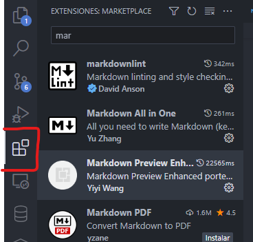
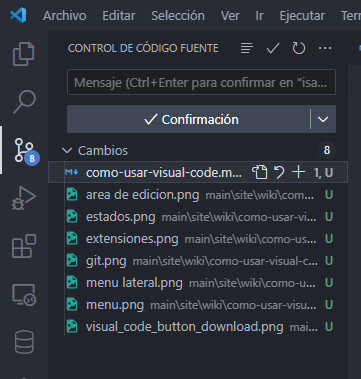
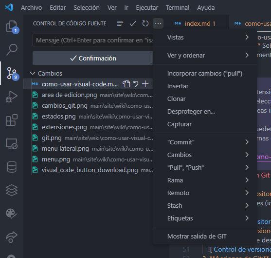

```{post} 2023-07-22
:author: isai.Dev343
:tags: IDE, VSCode
:category: wiki
:language: Español
:excerpt: 1
```

## Guía rápida para usar Visual Studio Code

1. Descarga Visual Studio Code desde el sitio web oficial: [https://code.visualstudio.com/](https://code.visualstudio.com/).
2. Sigue las instrucciones de instalación según tu sistema operativo.

    [](https://code.visualstudio.com/)

## Interfaz de usuario

1. **Barra de menú:** Contiene opciones para gestionar el editor y los proyectos.
   
2. **Barra lateral:** Muestra el explorador de archivos, extensiones, control de versiones, etc.
   
3. **Explorador:** Muestra los archivos y carpetas de tu proyecto. Puedes crear, eliminar, renombrar y mover archivos.
   
4. **Área de edición:** Aquí es donde abres y editas tus archivos. Puedes cambiar entre archivos haciendo clic en sus pestañas.
   
5. **Barra de estado:** Proporciona información sobre el archivo abierto y las extensiones activas. Está ubicado en la parte inferior de la ventana.
    

## Comandos básicos

Todos estos comandos se pueden encontrar en la barra de menú. Pero también puedes usar los atajos de teclado que se muestran a continuación.

1. **Abrir un archivo:** Haz clic en "Archivo" en la barra de menú o presiona `Ctrl + O` (Windows/Linux) o `Cmd + O` (Mac) para abrir un archivo.
2. **Guardar un archivo:** Haz clic en "Archivo" y selecciona "Guardar" o presiona `Ctrl + S` (Windows/Linux) o `Cmd + S` (Mac).
3. **Deshacer y rehacer:** Usa `Ctrl + Z` (Windows/Linux) o `Cmd + Z` (Mac) para deshacer y `Ctrl + Shift + Z` (Windows/Linux) o `Cmd + Shift + Z` (Mac) para rehacer.
4. **Buscar y reemplazar:** Abre la barra lateral y selecciona la pestaña "Buscar" (`Ctrl + F` o `Cmd + F`) para buscar en el archivo actual. Utiliza la pestaña "Reemplazar" para cambiar texto.
5. **Seleccionar texto:** Haz doble clic para seleccionar una palabra o tripe clic para seleccionar una línea completa. Usa `Ctrl + D` (Windows/Linux) o `Cmd + D` (Mac) para seleccionar múltiples ocurrencias.
6. **Comentarios:** Selecciona el código y presiona `Ctrl + /` (Windows/Linux) o `Cmd + /` (Mac) para comentar o descomentar líneas.

## Extensiones

Puedes instalar extensiones desde la tienda de extensiones de Visual Studio Code. Abre la barra lateral y selecciona la pestaña de extensiones (icono de cubo). Busca la extensión que deseas instalar, haz clic en **"Instalar"** y luego en **"Recargar"** para activarla.
Las extensiones pueden agregar nuevas características a VS Code o **integrarse** con herramientas externas como linters, editores de texto, formateadores, etc.



## Integración con Git

1. **Inicializar repositorio:** Abre la barra lateral y selecciona la pestaña de control de versiones (icono de Git). Puedes inicializar un repositorio o clonar uno existente.
   
2. **Control de versiones:** Verás los cambios sin guardar en el área de "Cambios". Escribe un mensaje descriptivo y haz clic en ✓ para confirmar los cambios.
   
3. **Acciones de Git:** Haz clic en los tres puntos para acceder a las acciones de Git. Aquí puedes crear una nueva rama, hacer un pull, push, etc.
   

## Personalización

1. **Temas:** Ve a "Archivo" > "Preferencias" > "Color del tema" para cambiar la apariencia de VS Code.
2. **Configuración:** Personaliza tu editor a través de "Archivo" > "Preferencias" > "Configuración".
3. **Atajos de teclado:** Si no te gusta el esquema de teclas predeterminado, puedes cambiarlo yendo a "Archivo" > "Preferencias" > "Atajos de teclado".

¡Listo! Con esta guía corta, deberías poder dar tus primeros pasos, recuerda que la mejor forma de aprender es practicando. 
Puedes ver mas tutoriales en la la categoria de **Wiki** de la comunidad.
